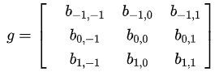

## 卷积的物理含义： 
> 参考：https://blog.csdn.net/weixin_39978863/article/details/111361942
## 三个前提 
### 每个输入都具有时效性：  
1.每个输入一直对后续状态有影响；  
2.每个输入的影响随时间逐渐减弱；
### 每个时刻都有输入 
### 卷积是当前时刻前所有输入产生结果的累加  
### 示例  
假设输入信号随时间变化，响应函数随时间指数下降，即如果t=0时刻有一个输入，那么随时间流逝，该输入的影响不断减弱。 
    
卷积结果：  
  
图中卷积方式比较别扭，因此卷积会进行翻转操作  
  
此时，还会存在错位，因此进行平移  
  
因此，在计算卷积时，要维持约束 t + (T - t) = T  

### 图像处理
对图像的处理函数记为g矩阵，如:
  
图像的卷积，同样需要将处理矩阵进行翻转  

计算卷积时：  

图像卷积能够提取特征的原因在于：  
构建合适的特征提取矩阵和图像相乘之后，对于非特征区域，卷积的结果为0  

对于上面的卷积：（50*30）+（50*30）+（50*30）+（20*30）+（50*30）=6600；  

对于上面的卷积：0；

 卷积核个数对应特征图个数，一般来说越大模型的学习性能越好，但同时计算量越大。模型学习的参数主要就是卷积核参数;  
 
池化即为下采样:    
    主要作用:  
    1.是保留主要的特征,同时减少参数(降维，效果类似PCA)和计算量，防止过拟合，提高模型泛化能力;  
    2.进行特征不变性的尺度变换；

## VGG原理：
VGG是采用连续的多个3*3卷积核代替较大卷积核，对于给定的感受野，采用堆积的小卷积核优于大卷积核，因为多层非线性层可以利用较小代价但通过增加网络深度保证学习更加复杂的模式。  
  