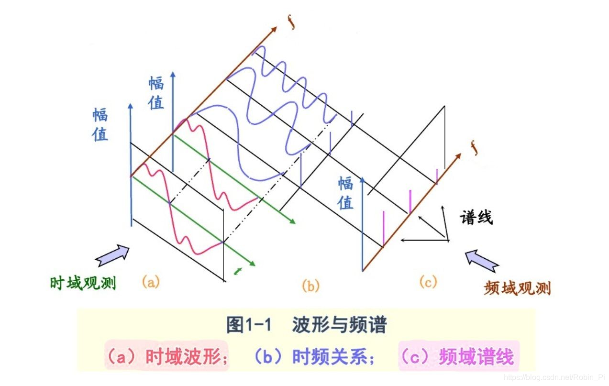
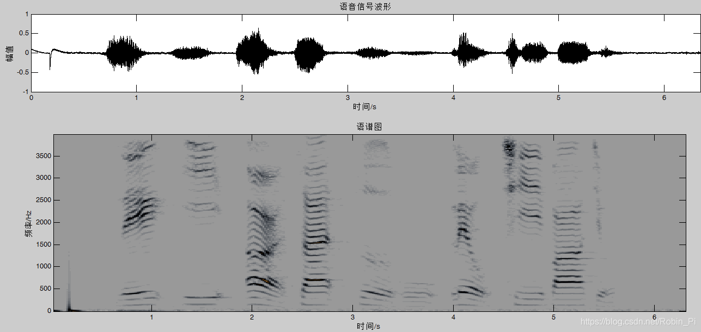
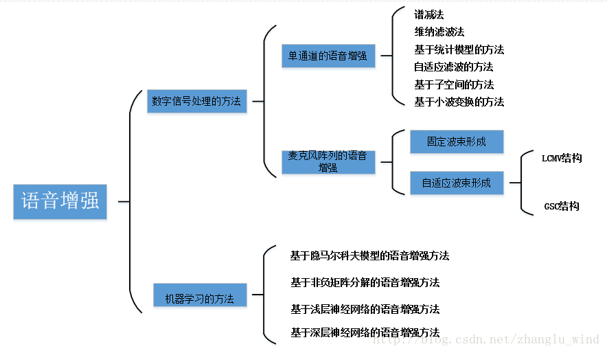

声音是模拟信号，声音的时域波形只代表声压随时间变化的关系，不能很好表示声音的特征，因此，必须将声音波形转换为声学特征向量

1.在一个域的相乘等于在另一个域的卷积；  
2.与脉冲函数的卷积，在每个脉冲位置上将产生一个波形的镜像；
> https://www.zhihu.com/question/23137926

  
图(1)为时域信号，通过傅立叶变换，得到图(2),时域和频域此时都是连续的，但是计算机只能处理数字信号，因此需要采样将模拟信号时域离散化图5(图1 x 图3)，频域相当于卷积图6(图2 * 图4)，此时，时域离散，频域连续,同样不能被计算机处理。进一步对频域采样图10(图6 x 图8)，时域卷积图9(图5 * 图7)，图10即为图5的离散傅立叶变换。

(1) 时域和频域：时域和频域是信号的基本性质，分析信号的角度称为域   
波形图：表示一段音频在一段时间内音量的变化，横轴为时间，纵轴为振幅；  
频谱图：表示一段音频包含各个频率谐波的振幅，横轴为频率，纵轴为振幅；

语谱图(时频图)：同时表示音频中频率、幅值随时间的变化，横轴为时间，纵轴为频率，颜色深浅表示振幅；

## 语音增强算法

单通道语音增强只利用时域和频域信息，而麦克风阵列不仅利用时域和频域信息，还利用空域信息。  

噪音主要是加性噪音和卷积噪音，在实际场景中加性噪音是主要的。

自适应滤波算法：  
用带噪音频拟合出噪声音频/纯净音频，LMS(拟合噪声音频/纯净音频，真实噪声音频/纯净音频)，得到预测的噪声音频/纯净音频

 缺陷在于：噪声/纯净音频 等先验知识不容易获得   

### 传统语音增强算法：  
谱减法：  
维纳滤波法：  
基于LMS的幅度谱和对数谱估计：    

### 基于隐马尔可夫模型的语音增强

 传统的语音降噪算法都无法对非平稳噪声有效抑制，且无法有效判断语音帧和非语音帧

## 去混响算法
1. WPE算法  
   假设观测信号由D个麦克风采集,则该信号由STFT变换之后可表示为一个D维向量yt,f​，其中时间index为t，频率index为f。  

## 回音消除算法
https://www.cnblogs.com/LXP-Never/p/11703440.html

## 语音合成算法(TTS)  
   将任意输入文本转成响应语音的技术
